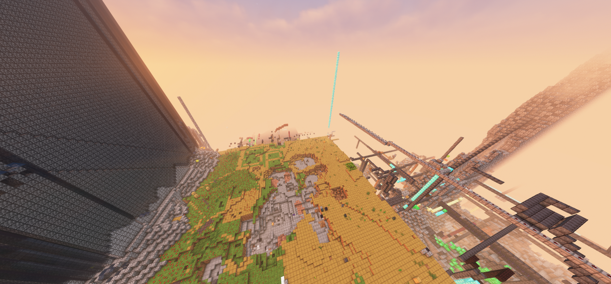
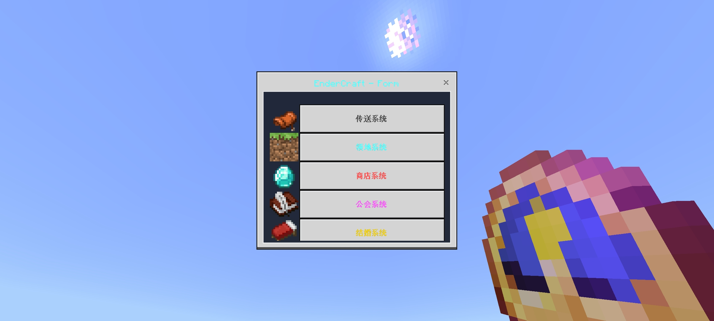

::: warning 已下线玩法
本玩法已于 **2025 年 8 月 13 日** 随重置前服务器（EnderCraft）一同关闭，本文为历史存档。页面所述机制、价格与界面均以停服前实际状态为准，与现版本（EnderRealm）无关。
:::

# 生存一区

<GameplayInfoCard
  title="生存一区（原家园生存）"
  :rows="[
    { label: '所属服务器', value: 'EnderCraft（重置前服务器）' },
    { label: '状态', value: '已关闭（2025-08-13）' },
    { label: '上线时间', value: '2023 年 4 月' },
    { label: '立项时间', value: '2023 年 1 月' },
    { label: '服务端核心', value: 'Nukkit PM1E' },
    { label: '客户端', value: '基岩版（多版本互通）' },
    { label: '主世界', value: '一号世界、地狱、末地' },
    { label: '难度', value: '困难' },
    { label: '人数上限', value: '50 人' },
    { label: '通用货币', value: '金币（E 币，不可充值）' }
  ]"
  footer="后期于 2025 年 3 月 30 日起进入无政府状态。"
>

</GameplayInfoCard>

## 概述

生存一区（原家园生存）是 EnderCraft 于 2023 年 1 月立项、2023 年 4 月正式上线的生存服务器，使用 Nukkit PM1E 核心驱动。玩家可在遵守《EnderCraft 玩家守则》的前提下自由探索与生存，并通过一整套插件系统扩展游戏体验：领地保护、全球市场、公会、结婚、好友、邮箱、签到等。

作为重置前服务器人气最高的玩法之一，生存一区见证了从纯净生存到无政府状态的完整演变，社区玩家为其编写了[《终界春秋》编年史](/玩法图鉴/历史旧玩法/生存一区/编年史)作为纪念。

## 消歧义

本文档介绍的是**重置前服务器（EnderCraft）**中的生存一区，与重置后服务器（EnderRealm）不存在继承关系，两者相互独立。

## 历史时间线

| 时间 | 事件 |
|------|------|
| 2022 年 12 月 | 进行技术验证，选择 Nukkit PM1E 核心（详见下文「技术背景」） |
| 2023 年 1 月 | 立项，服务端各系统开始部署 |
| 2023 年 4 月 | 正式上线 |
| 2023 年 7 月 | 社区活跃期开始，《终界春秋》记载自此起笔 |
| 2023 年 8 月 2 日 | 生存二区（史诗地形）开放 |
| 2024 年 2 月 8 日 | 服主宣称生存一区年后将进入无政府状态，不再更新内容 |
| 2025 年 3 月 30 日 | 正式进入无政府状态（见下文「服务状态通告」） |
| 无政府时期 | 官方开放自研刷取系统 `/dump`（详见[经济与商店](/玩法图鉴/历史旧玩法/生存一区/经济与商店)） |
| 2025 年 8 月 13 日 | 随服务器关闭，玩法停服 |

## 技术背景：PM1E 核心争议

本项目于 2022 年 12 月进行技术验证时选择 Nukkit PM1E 核心，主要基于其显著的技术优势：

- 完美支持多版本客户端协议（1.2–1.19+）。
- 实现比原版 Nukkit 更完整的原版特性（含红石、生物 AI 等生存关键机制）。
- 2023 年 1 月立项时，同类核心中唯一能提供合格生存体验的解决方案。

在 2023 年 4 月正式上线前的测试阶段，该核心原作者突然闭源其仓库，此行为违反了其基于的 NukkitX 项目（GPLv3 协议）的开源义务，并导致本服面临核心层无法维护的风险。

团队曾尝试更换核心，但发现生存区对区块生成、实体行为等底层特性高度敏感，当时市面替代方案均存在严重特性缺失（如生物 AI 问题等）。最终决定：谴责该违反开源协议的行为；为保障玩家体验，生存区保留原有核心；其他服务已迁移至合规技术。

## 进入与游玩

生存一区为基岩版玩法，客户端连接服务器即可进入。进入后，背包中会持有一把**快捷菜单（钟）**，手持并使用即可打开功能菜单「EnderCraft - Form」。

*快捷菜单主界面*

主菜单共十个入口：

| 入口 | 对应系统 | 专项页面 |
|------|----------|----------|
| 传送系统 | 家、玩家传送、世界传送 | [传送与世界](/玩法图鉴/历史旧玩法/生存一区/传送与世界) |
| 领地系统 | 圈地与领地权限 | [领地系统](/玩法图鉴/历史旧玩法/生存一区/领地系统) |
| 商店系统 | 全球市场 | [经济与商店](/玩法图鉴/历史旧玩法/生存一区/经济与商店) |
| 公会系统 | 公会创建与经营 | [公会与结婚](/玩法图鉴/历史旧玩法/生存一区/公会与结婚) |
| 结婚系统 | 求婚、夫妻公共资产 | [公会与结婚](/玩法图鉴/历史旧玩法/生存一区/公会与结婚) |
| 好友系统 | 好友、物品邮寄 | [好友与邮箱](/玩法图鉴/历史旧玩法/生存一区/好友与邮箱) |
| 邮箱系统 | 个人邮件、系统邮件 | [好友与邮箱](/玩法图鉴/历史旧玩法/生存一区/好友与邮箱) |
| 显示设置 | UI 样式切换 | [界面与辅助功能](/玩法图鉴/历史旧玩法/生存一区/界面与辅助功能) |
| 其他功能 | 称号 | [界面与辅助功能](/玩法图鉴/历史旧玩法/生存一区/界面与辅助功能) |
| 账号状态 | 软封禁状态查询 | [界面与辅助功能](/玩法图鉴/历史旧玩法/生存一区/界面与辅助功能) |

## 经济与货币

- 服务器使用统一货币（玩家间习称 **E 币**或**金币**），**不可充值**，仅能通过游戏内途径获得。
- 首次进入服务器赠送 **1000** 初始资金。
- 货币用于：圈地、传送、求婚、创建公会、玩家间交易与全球市场消费等几乎所有系统。
- 经济史是生存一区历史的重要部分：官方商店回收、清商店事件与后期刷物泛滥共同塑造了经济的多次膨胀与洗牌，详见[编年史](/玩法图鉴/历史旧玩法/生存一区/编年史)。

## 常用指令

| 指令 | 功能 |
|------|------|
| `/mytp open` | 打开传送系统菜单 |
| `/land create` | 用木锄选区后创建领地 |
| `tw` | 打开全球市场 |
| `tw add` | 将手上物品上架全球市场 |
| `tw sell` | 打开物品回收 |
| `公会` | 打开公会系统 |
| `结婚` | 打开结婚系统 |
| `好友` | 打开好友系统 |
| `mail` | 打开邮箱系统 |
| `tips theme` | 打开显示设置 |
| `ch` | 打开称号系统 |
| `qd` | 每日签到（进服自动执行） |
| `/dump` | 向「伍兹之神」祷告，复制整个背包（仅无政府时期开放） |
| `sb form` | 查询账号（软封禁）状态 |

部分指令以聊天栏中文形式触发（如 `公会`、`结婚`、`好友`），这是当时快捷菜单采用的入口设计。

## 服务状态通告（存档）

> **无政府状态声明**
>
> 因团队开发精力有限及历史遗留问题，生存一区玩法已于 **2025 年 3 月 30 日**起进入无政府状态：
>
> - 团队不再提供玩法更新、事件调解等管理支持；
> - 仅维持服务器基础运行与崩溃修复；
> - 玩家行为完全自主。

停服前，服务器关闭时会向在线玩家显示「服务器即将关闭！将为您寻找其他可用服务器」，并自动将玩家转移至 EnderRealm 新服务器（mc.enderrealm.cn）。

## 相关页面

- [领地系统](/玩法图鉴/历史旧玩法/生存一区/领地系统)
- [经济与商店](/玩法图鉴/历史旧玩法/生存一区/经济与商店)
- [好友与邮箱](/玩法图鉴/历史旧玩法/生存一区/好友与邮箱)
- [公会与结婚](/玩法图鉴/历史旧玩法/生存一区/公会与结婚)
- [传送与世界](/玩法图鉴/历史旧玩法/生存一区/传送与世界)
- [界面与辅助功能](/玩法图鉴/历史旧玩法/生存一区/界面与辅助功能)
- [终界春秋——生存一区编年史](/玩法图鉴/历史旧玩法/生存一区/编年史)
