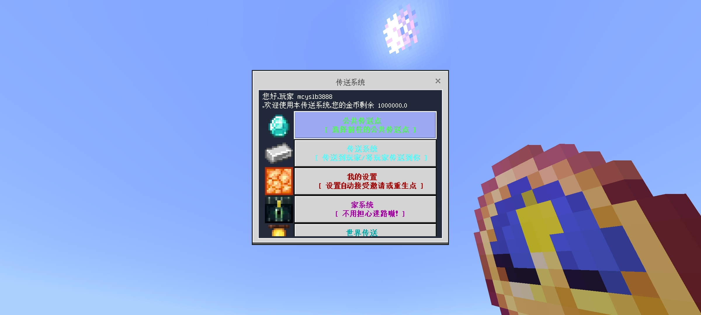

::: warning 已下线玩法
本文属于已关闭的旧玩法[生存一区](/玩法图鉴/历史旧玩法/生存一区/)的历史存档，机制与价格以停服前实际状态为准。
:::

# 传送与世界

传送系统基于 Nukkit 插件 **Mytp**（作者 glorydark，v1.1.8.4），通过 `mytp open` 指令或主菜单进入。

*传送系统主菜单*

## 家系统

- 每位玩家最多可设置 **5 个家**，设置一个家花费 **10 金币**。
- 支持「自带床特性」：使用床睡觉即可快速关联据点。
- 家可设置在主世界「一号世界」、地狱与末地。

## 玩家传送

- **申请传送**：向目标玩家发起传送申请，或邀请对方传送到自己身边，每次花费 **10 金币**。
- **信任名单**：可将常用伙伴加入信任名单，允许对方免申请直接传送到自己身边；也可在设置中关闭、禁止他人直接传送。

## 死亡与随机传送

- **返回死亡点**：回到上一次死亡的地点，花费 **1000 金币**。
- **随机传送（RTP）**：在荒野随机落点，**免费**，是初期开荒远离出生点的主要方式。

## 世界传送

服务器由多世界组成：主世界「一号世界」、地狱（nether）与末地（the_end），玩家可在允许的世界间跨维度传送。

### 末地

末地基于 Nukkit 插件 **TheEnd**（作者 wode490390，v1.2.0）实现完整玩法：

- 末地传送门与折跃门开启，可正常进入与返回；
- 末影龙正常生成，且**支持再次召唤**，可反复挑战；
- 末地为领地黑名单世界（仅管理员可圈地）。

末地相关事件（首杀末影龙、末地两次存档重置、末地祭坛领地被破等）见[《终界春秋》编年史](/玩法图鉴/历史旧玩法/生存一区/编年史)。

### 著名地点

- **114514 海岛**：玩家利用重生点 Bug「超传」至极远坐标建立的海岛（已被摧毁）；
- **条纹之地**：截止停服，服务器内玩家所抵达的最远点。

## 相关历史

- **重生点 Bug 超传（2023-07-25）**：在地狱死亡时有概率重生至主世界对应坐标，被玩家当作不稳定的超传手段使用，后被修复。
- **出生点攻防**：新老出生点石墙的加厚、炸开与封锁贯穿了 2023 年下半年的历史。

完整经过见[《终界春秋》编年史](/玩法图鉴/历史旧玩法/生存一区/编年史)。
