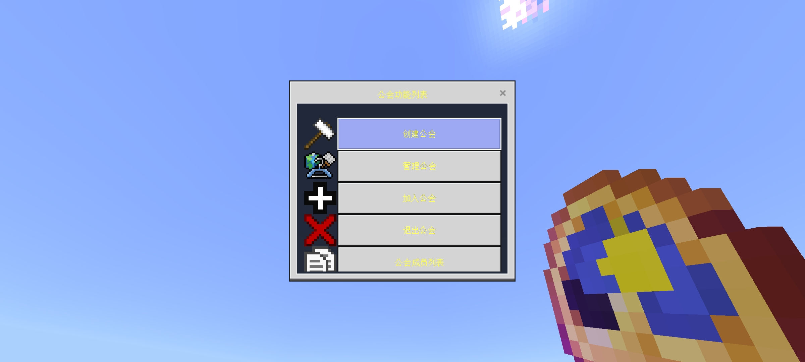
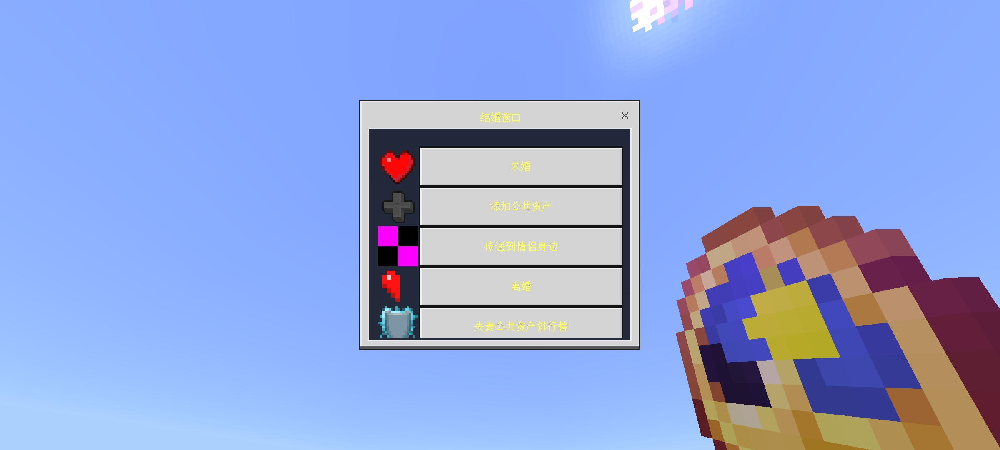

::: warning 已下线玩法
本文属于已关闭的旧玩法[生存一区](/玩法图鉴/历史旧玩法/生存一区/)的历史存档，机制与价格以停服前实际状态为准。
:::

# 公会与结婚

公会与结婚同属一套社交体系（Nukkit 插件 **ZSociety**，作者 zixuan007，v1.0.8alpha），玩家的公会、称号与婚姻状态会共同显示在聊天前缀与头顶名牌中。

## 公会系统

*公会系统界面*

- **创建公会**：花费 **100000 金币** 创建，公会名全网唯一。
- **成员与职位**：公会职位分为**会长**（1 人）、**副会长**（1 人）、**元老**（2 人）、**精英**（1 人）与普通成员；单个玩家仅限加入一个公会。
- **公会等级**：公会通过资金与成员贡献提升等级，共 7 级，人数上限从 10 人逐级提升至 70 人，升级所需资金从 1000 金币逐级递增至 1000000 金币。
- **公会排行榜**：按成员贡献累积排名，高级公会在排行榜与聊天前缀中一览无余。
- **公会商店**：公会可经营专属商店，向成员出售物品。

### 公会等级表

| 等级 | 人数上限 | 所需资金（金币） |
|------|----------|------------------|
| 1 | 10 | 1,000 |
| 2 | 20 | 10,000 |
| 3 | 30 | 20,000 |
| 4 | 40 | 40,000 |
| 5 | 50 | 80,000 |
| 6 | 60 | 100,000 |
| 7 | 70 | 1,000,000 |

编年史记载的「八级公会」为玩家社群对顶级公会（如「大不列颠及北尔兰联合王国」）的俗称。

### 公会历史高光

- **2023 年 8 月上旬**：Cheese 小镇成为「闪金 PVP」公会基地，闪金 PVP 成为服务器有史以来人数最多的公会。
- **2023 年 11 月 18 日**：「大不列颠及北尔兰联合王国」成为服务器第一个八级公会。

## 结婚系统

*结婚窗口：求婚、公共资产、传送、离婚与排行榜*

- **选择性别**：首次进入服务器时需选择性别。
- **求婚**：可向任意玩家求婚，**不限性别**；求婚需花费 **100000 金币**。
- **夫妻功能**：结婚后解锁——
  - **添加公共资产**：夫妻共同存款；
  - **传送到情侣身边**：无视距离的配偶传送；
  - **夫妻公共资产排行榜**：全服夫妻资产排名。
- **离婚**：解除婚姻关系。
- **状态显示**：已婚玩家的聊天信息与头顶名牌会显示「已婚」与红心标识；未婚玩家显示「单身」。
