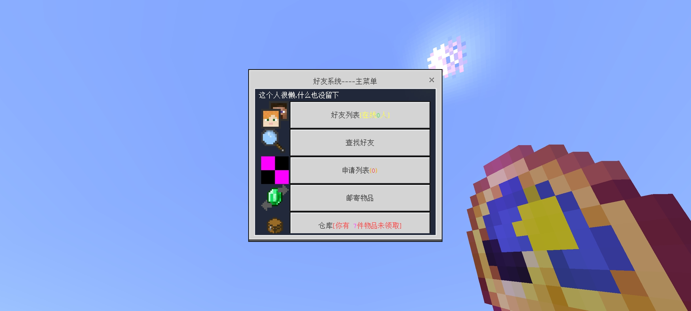
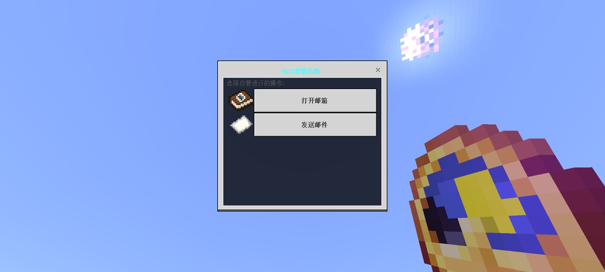

::: warning 已下线玩法
本文属于已关闭的旧玩法[生存一区](/玩法图鉴/历史旧玩法/生存一区/)的历史存档，机制与价格以停服前实际状态为准。
:::

# 好友与邮箱

*好友系统界面*

## 好友系统

好友系统基于 Nukkit 插件 **Friends**（作者 若水，v1.1.7），通过聊天栏输入 `好友` 或主菜单进入。

- **添加好友**：向其他玩家发出好友申请，对方同意后建立好友关系。
- **上线通知**：好友上线时会收到提醒。
- **物品赠予与邮寄**：支持向好友直接赠予物品，或通过邮寄渠道远程寄送。邮寄需支付 **200 金币**手续费，包裹在仓库中的保存时长为 **7 天**，逾期将被清理。
- **私信留言与临时对话**：即使对方不在线，也可留下私信。

系统同时预留了好友「群组」功能的配置位（群上限 5 人），但该功能在停服前始终处于开发中，从未上线。

## 邮箱系统

邮箱系统基于 Nukkit 插件 **MailSystem**（作者 EmeraldGames Team，v1.0.0），是玩家间的异步信件与官方公告渠道。

*邮箱系统界面*

- **个人邮件**：向指定玩家发送文字寄语，可附上手上持有的物品与数量，对方上线后即可领取。
- **系统邮件**：官方向全体或指定玩家发送的全局邮件，进服 **15 秒**后会自动弹出标记为「必读」的系统邮件，用于发布公告、事件说明与补偿发放。
- **拍卖行**：邮箱系统内建竞拍功能，卖家设定起拍价与拍品后，买家逐次加价、价高者得（详见[经济与商店](/玩法图鉴/历史旧玩法/生存一区/经济与商店)）。
