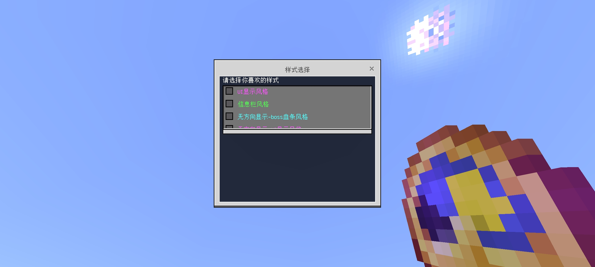
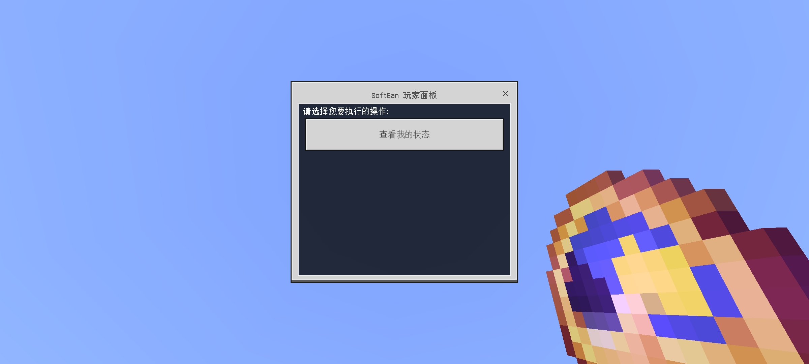

::: warning 已下线玩法
本文属于已关闭的旧玩法[生存一区](/玩法图鉴/历史旧玩法/生存一区/)的历史存档，机制与价格以停服前实际状态为准。
:::

# 界面与辅助功能

本页收录生存一区的界面显示、签到福利与秩序管理相关功能。这些系统多为管理组自研或深度定制，是「EnderCraft 体验」的重要组成部分。

## 显示设置

*显示设置菜单*

通过 `tips theme` 指令或主菜单「显示设置」进入，基于 Nukkit 插件 **Tips** 及变量扩展实现，可在多种信息展示样式间切换：

- **服务器特有 UI**：经典模式显示于屏幕右上角，携带版布局显示于中上位置，可展示手持物品、所在地图、生命值、在线人数、延迟、职位、金币、公会等级等信息；
- **原版 ActionBar**：仅在屏幕上方显示基础信息；
- **Boss 血条**：以血条形式展示相关状态。

另支持**隐藏方向显示**。玩家的称号、VIP、公会、婚姻状态（单身/已婚）会统一接入上述显示变量。

## 称号系统

通过 `ch` 指令或「其他功能」菜单进入称号系统，可佩戴称号展示在聊天与名牌中，称号商店支持使用金币购买称号。

## 签到系统

- 每日签到奖励 **100 金币**；
- **累计签到**第 3、5、7 天额外获得 **1 颗钻石**，并有 15% 概率获得绿宝石；
- 支持**补签卡**补齐漏签的日期；
- 玩家进入服务器时会自动执行签到指令，无需手动输入。

## 扫地大妈（掉落物清理）

服务器每隔 **5 分钟**自动清理一次掉落物，清理前 30 秒全服预告：

> §b\<扫地大妈\>: §a还有30秒清理垃圾~

清理完成后播报本次清理的垃圾堆数。这一机制逼得后期囤积党练就了「赶在扫地前捡回物资」的肌肉记忆，也间接影响了刷物时代物资的流通节奏。

## 飞行权限

管理员及获授权玩家可使用飞行指令，普通玩家默认无飞行权限。

## 软封禁系统

软封禁为管理组**自研插件**（`cn.enderrealm.softban`），用于对违规玩家施加时间维度的限制，而非直接封禁账号：

*软封禁管理界面*

- 被软封禁的玩家每日可游玩时间存在上限（文档记载为每日 **30 分钟**，停服前配置曾调整为 5 分钟），可自由选择游玩时段；
- 限制在**次日凌晨 4:00** 自动解除，系统每分钟提醒剩余时间；
- 未受软封禁的玩家不受影响。

## 秩序与跨服

- **封禁系统（BanSystemNK）**：处理账号封禁与解封，配合禁止指令插件限制特定命令的使用。
- **跨服聊天（UIShout）**：生存区#1 与网络内其他服务器的聊天互通，公屏消息跨服可见。
- **PVP 优化（CustomKnockback）**：按世界（主世界、地狱、末地）独立调整击退参数，保证不同场景下的战斗手感一致。

## 服务端许可校验（Eula 插件）

自研插件 **Eula**（v2.0.0）是面向**开服运营者**而非玩家的门禁插件，用于将服务端的运行权与《EnderCraft 服务端最终用户许可协议》的同意状态绑定：

- **协议自动分发**：插件启动时若本地没有协议文档，会自动从官方 Git 仓库下载最新版 EULA（协议按服务器分目录管理，生存一区对应 `EnderCraft/Survival_Zone_1/Eula_latest.md`），保存到插件目录；
- **延迟检查**：服务器完整加载 **30 秒后**执行检查，读取配置项 `eula`；
- **不同意即关机**：`eula: false` 时控制台输出醒目警告——「您需要同意EULA协议才能运行服务器」，并在 **3 秒后自动关闭服务器**；检查过程发生任何异常同样会立即关机，即宁可拒绝运行也不在未同意协议的状态下提供服务；
- **同意后放行**：将配置改为 `eula: true` 后，服务器正常启动并记录「EULA协议已同意，服务器正常运行」。

这套机制与 Minecraft 正版服务端的 `eula.txt` 同构，但管的是 EnderCraft 自己分发的服务端：谁想运营这套服务端，谁就必须先接受官方条款。停服存档中该配置停留在 `eula: false`——服务器最后一次关闭后，再无人把它改回 true。
