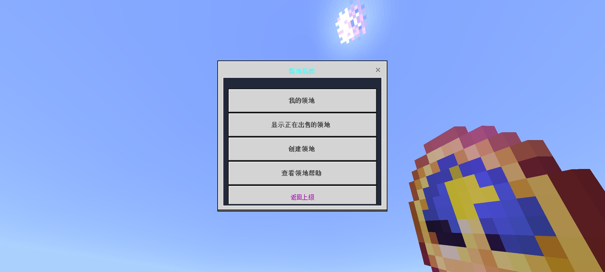
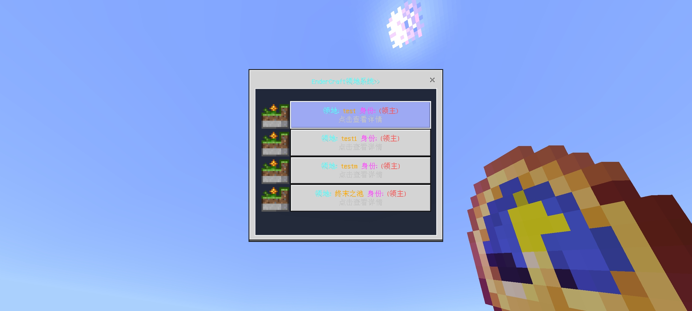

::: warning 已下线玩法
本文属于已关闭的旧玩法[生存一区](/玩法图鉴/历史旧玩法/生存一区/)的历史存档，机制与价格以停服前实际状态为准。
:::

# 领地系统

领地系统基于 Nukkit 插件 **Land**（作者 若水/smallaswater，v1.8.7）搭建，是生存一区中保护玩家建筑成果的核心系统。

*领地系统主菜单*

## 基本规则

- **圈地工具**：木锄。手持木锄选定长方体范围的两角后，输入 `/land create` 创建领地。
- **价格**：每个方块 **1 金币**，子领地同样按每方块 1 金币计费。
- **数量上限**：每位玩家最多可拥有 **30** 块领地，子领地合计上限 **300**。
- **出售领地**：领地出售给系统时返还原价格的 **50%**，出售展示期 **7 天**。
- **黑名单世界**：末地（the_end）与世界 `world` 为领地黑名单世界，除管理员外不可圈地；主世界「一号世界」与地狱可正常圈地。
- 领地系统启用了增强资源包，用于领地范围的可视化提示。

## 权限管理

领地创建后，通过领地菜单可对领地进行管理，包括设置他人对本领地的使用权限、转让、出售、子领地划分等操作。

*「我的领地」管理界面*

## 相关历史

领地系统的漏洞与攻防是生存一区后期历史的重要线索：

- **2023 年 11 月 26 日**：玩家 `hana10124` 发现破领地的方法，并破除了服主设于末地的祭坛领地。该漏洞在日后对服务器产生了重大影响，也直接促成了无政府化的进程之一。
- **2024 年 1 月 6 日**：出生点领地被利用漏洞破坏并浇筑石墙。

完整经过见[《终界春秋》编年史](/玩法图鉴/历史旧玩法/生存一区/编年史)。
